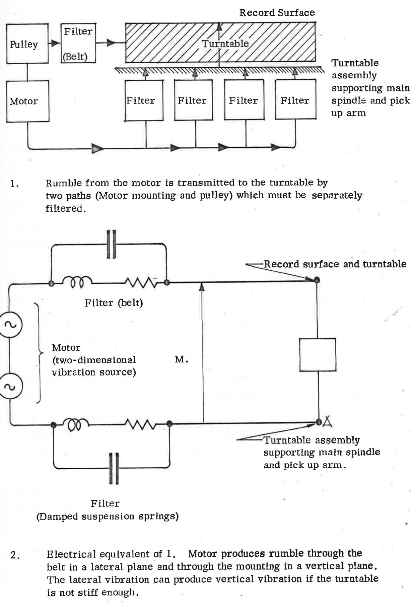
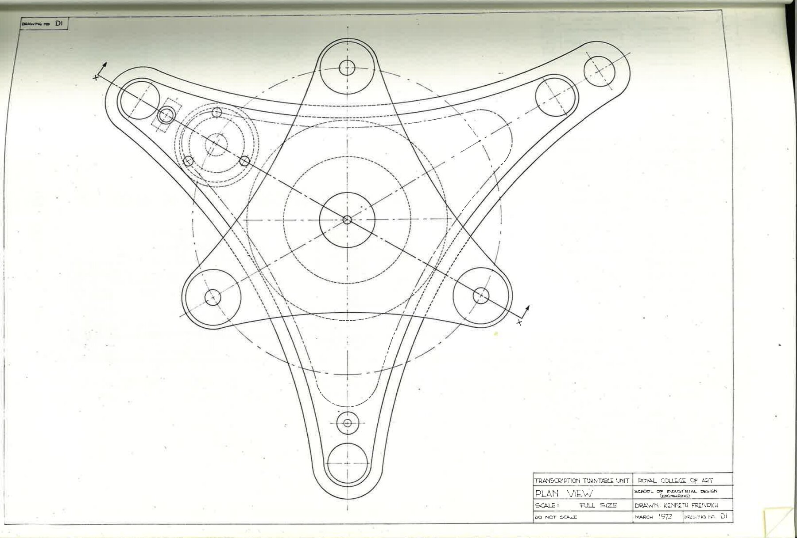
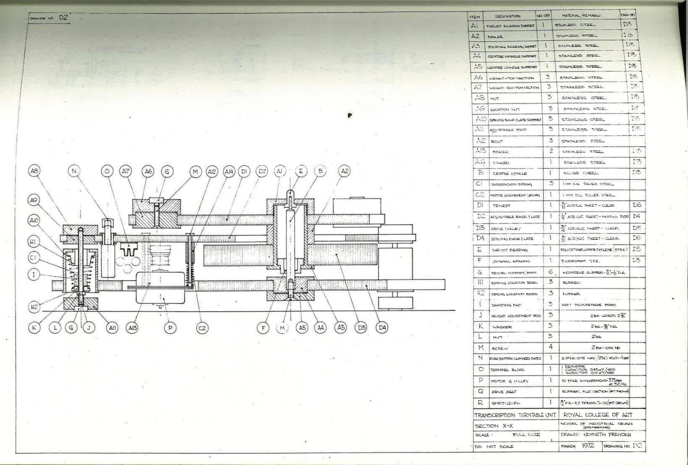
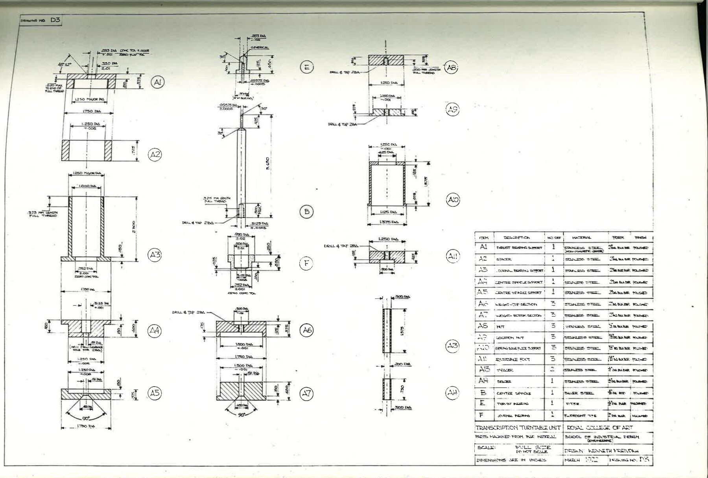
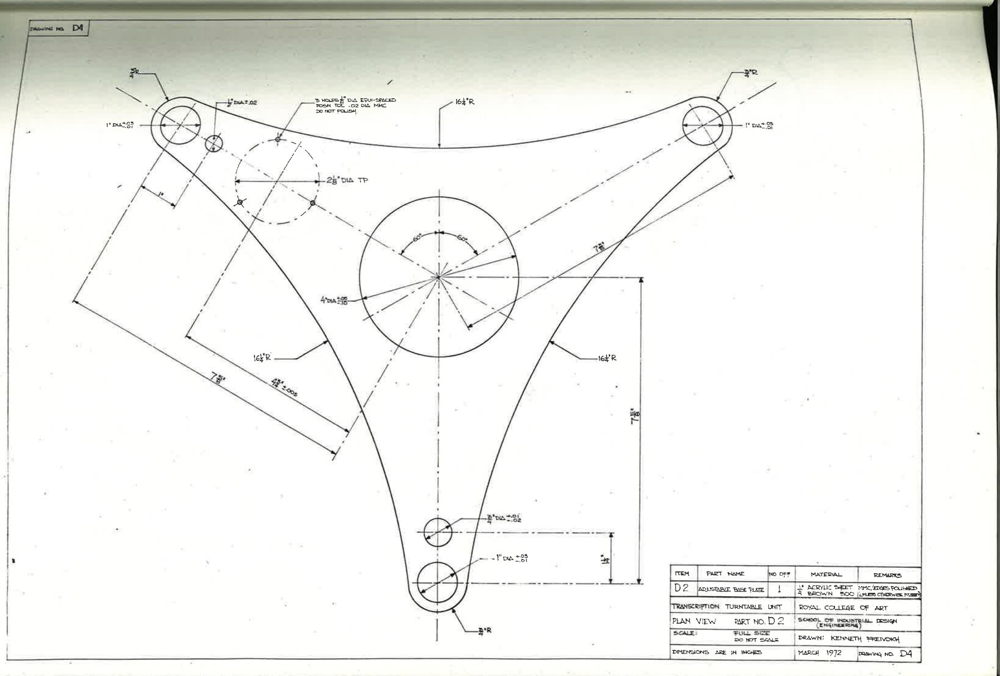
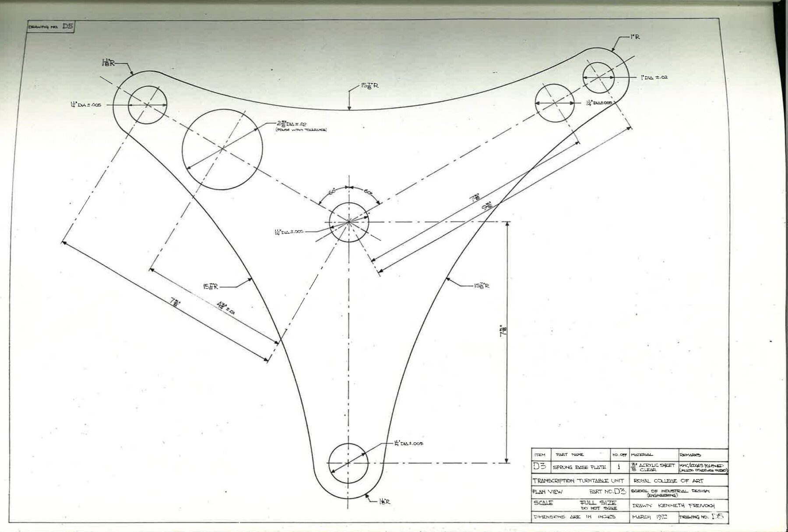
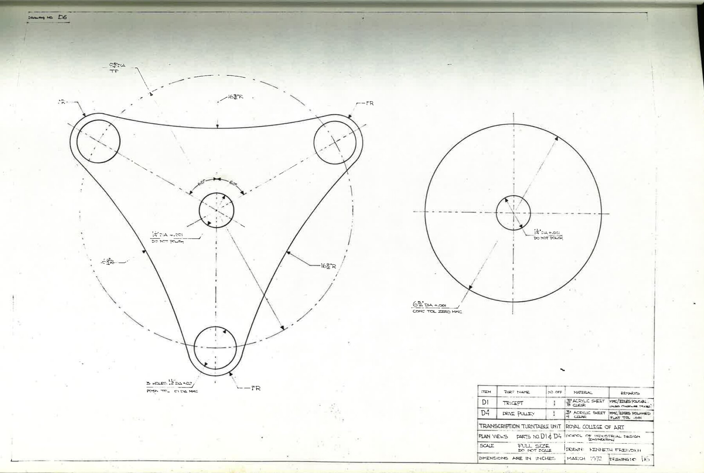
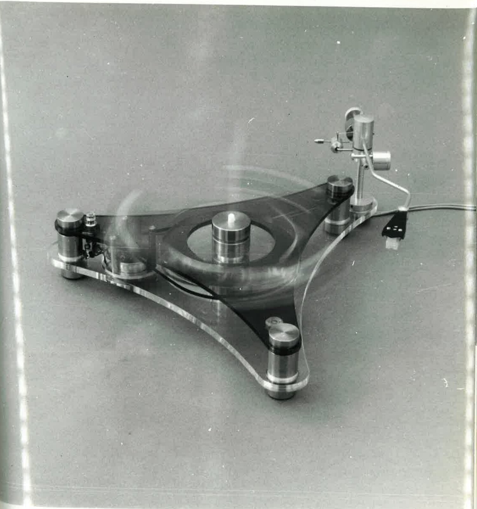
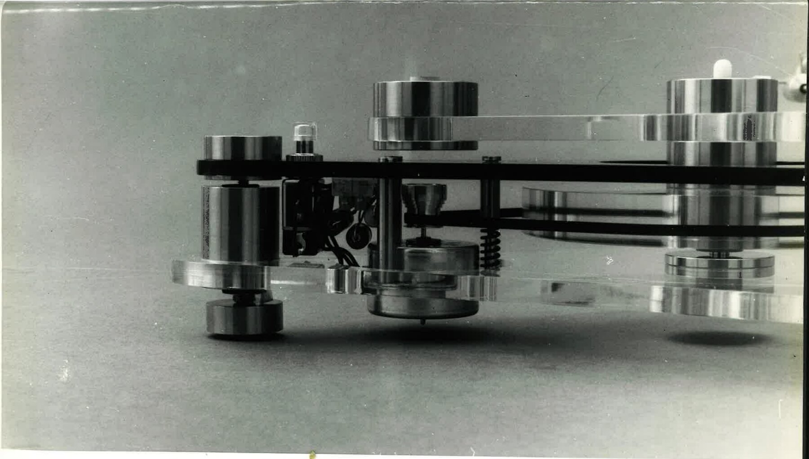

# A Transcription Turntable Unit (1972)

Kenneth Freivokh, *A Transcription Turntable Unit: A Report on an Experimental Design Project in the Field of Domestic Audio Equipment*. Presented to the Royal College of Art, School of Industrial Design (Engineering), March 1972. 37 typed pages, six engineering drawings and six photographs.

Ken Freivokh sent the archive this scan of his own bound copy in October 2026. For the background to the thesis and how it relates to the GT2101, see [Early Machines](/GT2101/early-machines/#ken-freivokhs-precursor-turntable).

<a href="/assets/docs/Freivokh-1972-A-Transcription-Turntable-Unit.pdf">⤓ Download the full scan (PDF, 49 pages, 4.7&nbsp;MB)</a>

About the scan. The scan is the primary source. In the first batch the bound volume was copied open, so the fold-out drawings and photographs at the back were cut off or partly folded over, and page 22 was missed. A second scan then copied page 22 and all twelve drawing and photograph pages flat. The PDF above puts the two batches together in page order and uses the flat rescans for those thirteen pages. Nothing on any page has been retouched.

About the transcription. The text below is a faithful transcription of the typed pages. It keeps Freivokh’s wording, spelling, punctuation and typing errors, which are not marked. Underlined titles are shown in italics. Page numbers from the original are given in square brackets. Footnotes are numbered as in the original, which restarts the numbering in each chapter. Comments by the archive appear only in the [archive notes](#archive-notes) at the end.

## What the thesis records

A short guide to the design as Freivokh describes it, with page references:

- Belt drive. A flat neoprene belt from a stepped pulley on the motor drives a clear acrylic pulley, at 33⅓ and 45 r.p.m. (p. 26).
- Motor. A 16-pole low-speed synchronous motor (375 r.p.m. at 50 Hz), rigidly mounted on the base plate and placed as far as possible from the cartridge (p. 26).
- The “tricept”. A triangular acrylic platform with three polished stainless-steel weights at its points replaces the usual platter and mat. Small rubber inserts on the weights support the record (pp. 20–21).
- Main bearing. A silver-steel centre spindle and a p.t.f.e. thrust bearing that also serves as the centre spindle for the record, with a Fluorosint journal bearing (pp. 22–23).
- Suspension. The tone arm and turntable sub-assembly share one sprung base plate. It sits on three adjustable conical springs over the feet, with soft polyurethane foam damping pads (pp. 24–25).
- Materials. Stainless steel cylinders and clear acrylic platforms, left unfinished so that the structure “does not attempt to conceal the simple operational principles proposed” (p. 19). Drawing D4 specifies the adjustable base plate in ¼in brown acrylic.
- Arm. The first prototype used a 10in unipivot arm with fluid damping and its own cueing (p. 20).

---

## Transcription

A TRANSCRIPTION TURNTABLE UNIT  
A Report on an Experimental Design Project 
in the Field of Domestic Audio Equipment 
Presented to the Royal College of Art 
School of Industrial Design (Engineering)  
KENNETH FREIVOKH &nbsp;<em>M. Des (RCA)</em> [handwritten] 
March, 1972

### Acknowledgements

<small>[p. 2]</small> Thanks are due to Mr. Peter Walker-Taylor and Mr. Kenneth Ireland, both of whom gave me the benefit of their practical experience and invaluable assistance in the construction of the final working prototype.

I would also like to express my appreciation to Mr. David Sykes, of Sykes and Hirsch Limited, who clarified my thoughts through helpful discussions and enabled me to work on several experimental components using the facilities available at his firm.

Of course, none of these kind people must be held responsible for my own mistakes.

K.F. 1972

### Contents

<small>[p. 3]</small>

| | Page |
|---|---:|
| Acknowledgements | 2 |
| List of Illustrations | 4 |
| Introduction | 6 |
| A Transcription Approach to Turntable Design | 8 |
| &emsp;1. Long Term Speed Stability | 10 |
| &emsp;2. Wow and Flutter | 11 |
| &emsp;3. Designing to Avoid Rumble | 13 |
| &emsp;4. Acoustic Feedback | 16 |
| &emsp;5. Hum | 17 |
| Description of the Design Proposal | 19 |
| &emsp;1. “The Tricept” | 21 |
| &emsp;2. Main Bearing Assembly | 22 |
| &emsp;3. Suspension System | 24 |
| &emsp;4. Drive System | 26 |
| Whither Hi-Fi? | 28 |
| A Transcription Turntable in the Home | 31 |
| Bibliography: Books | 36 |
| Bibliography: Periodicals | 37 |

### List of Illustrations

<small>[p. 4]</small>

| No. | Illustration | Page |
|---:|---|---:|
| 1. | Filters to minimize rumble | 15 |
| 2. | Electrical equivalent of Fig 1 | 15 |
| 3. | Drawing No. D1, Plan View | 38 |
| 4. | Drawing No. D2, Section X-X | 39 |
| 5. | Drawing No. D3, Parts machined from bar material | 40 |
| 6. | Drawing No. D4, Plan view of adjustable baseplate | 41 |
| 7. | Drawing No. D5, Plan view of sprung baseplate | 42 |
| 8. | Drawing No. D6, Plan view of sprung baseplate | 43 |
| 9. | Perspective view of turntable complete with tone arm and cartridge | 44 |
| 10. | View of turntable with revolving tricept | 45 |
| 11. | Front perspective view | 46 |
| 12. | Detail of unipivot tone arm | 47 |
| 13. | Detail of arm mounting and anti-skating system | 48 |
| 14. | Detail of drive belt, drive pulley, motor and associated electrical components | 49 |

<small>[p. 5]</small>

> “It is to be noted that when any part of this paper appears dull, there is a design in it.”
>
> Richard Steele, 1671 – 1829, “The Tatler” No. 38

### Introduction

<small>[p. 6]</small> The intention of this report is to explore significant aspects of turntable design and discuss the work carried out on a transcription unit of high standards of performance.

An attempt is made to follow through the various stages of the project, from the analysis of the problems involved and subsequent formulation of first objectives to the final design proposals and experimental working prototypes.

The project forms an integral part of a design programme which involved almost two years of research into the field of domestic audio equipment. As in previous projects related to other links of the hi-fi chain, the prime objective has been to learn more about the subject, at both a theoretical and practical level.

Interest in this design exercise can be traced back to a previous project for a turntable plinth system, which called for a comprehensive survey on existing ready-made components with views to select necessary parts for a complete record playing unit. The choice of tone arms and cartridges which complied with the requirements of the brief was found to be adequate. However, finding a suitable motor/turntable unit proved to be more difficult.

<small>[p. 7]</small> In the process it became increasingly apparent that, in order to attain hi-fi performance specifications consistent with DIN 45/500 standards\*, most manufacturers had opted for design solutions which, relative to their performance and intended market, appeared to be unnecessarily complex. The incorporation of electronic speed control devices, servo-controlled mechanisms, direct-drive motors, etc. necessitates a considerable increase in the cost of these units.

First attempts to evaluate the basic functional requirements for a transcription turntable confirmed the impression that this was a subject on which there was plenty of scope for development. Consequently, this exercise was started with the intention of determining whether such requirements could be met through a different approach to the problem.

With regard to the price bracket into which transcription turntables fall, the aim of the project is to design an above-average product, representing a worthwhile advance on existing units.

<small>\* Published by Deutscher Industrie Normenausschuss (German Standards Institute) - specifies minimum requirements and frequency response tolerances for high f idelity audio equipment.</small>

### A Transcription Approach to Turntable Design

<small>[p. 8]</small> The function of a turntable is to rotate records at a standard speed with sufficient constancy to avoid audible wow and flutter and with sufficient freedom from vibration to avoid adding extra noise to the reproduction. The assembly usually consists of a platter, an electric drive motor with associated mechanical and electrical items and commonly a “motor plate” for mounting the unit on to the main motor board, either directly or via spring suspensions.

The word “transcription” is commonly applied to better quality electro-mechanical devices - particularly turntables - implying a professional standard of performance “a practice inherited from a time when the type of unit now regarded as desirable for domestic hi-fi installation was normally only found in professional studios and frequently when transcribing recorded material from disc to disc.”(1)

The separate turntable and arm combination, if correctly assembled of high-grade parts, can be said to offer the highest performance possible at any given time in the state of the art consistent with professional or “ultracritical” needs. The tone arm is not required to serve auxiliary <small>[p. 9]</small> functions such as triggering changing or lifting mechanisms, nor is the motor called on for any function other than turning the platter. (Such functions, normally associated with the operation of automatic record-changers, contribute to degrade their performance).

Durability and construction of this type of unit is generally in keeping with the concepts of heavy-duty, long term use and facility to experiment. The technically knowledgeable and experimentally inclined user is therefore offered the possibility of making his own combinations, including the updating of the turntable with the newest and most refined parts.

The sources of imperfection in a turntable lie in the parameters of wow and flutter, rumble and generated hum fields. A transcription unit should be “neutral”, providing no more than a horizontal surface rotating at the correct speed about a centre spindle of standard size, the surface offering sufficient friction to grip records without risk of damage. There should be no mechanical vibration, electrical interference or radiated sound.

Adequate attention to detail in design, finish and lubrication characterise the transcription approach to these points with, in particular, many refinements and variations in motor-to-platter drive arrangements.

#### 1. Long Term Speed Stability

<small>[p. 10]</small> The function of a turntable unit is to spin records at the correct speed and at a constant velocity as quietly as possible.

It the turntable is running too slowly or too fast the reproduction will be pitched slightly lower or higher than the original. (It is noteworthy that some recordings themselves are in very slight pitch error when spinning at the correct speed due to additive variations in the original tape recording speed and the lacquer disc cutting speed.)

DIN 45/500 lays down a minimum tolerance for turntable speed of +1.5% and -1%.

Long-term speed changes can be caused by variation in frictional drag from pickups and/or disc cleaning devices as they traverse the record, changes in bearing friction as equipment warms up, and fluctuation of mains supply voltage.

Solutions come from the use of more powerful motors and from attention to design details of bearings and the drive transmission system.

Of greater importance than consistent speed error, assuming that it is very mild (e.g. an error of about 0.2% corresponds to a change of less than 1/30th of a semitone in pitch), are cyclic speed changes which can produce a wavering of pitch or introduce a “roughness” into the reproduction.

#### 2. Wow and Flutter

<small>[p. 11]</small> “Correct turntable speed” means not only that discs shall be rotated at 33⅓ or 45 r.p.m., but that from instant to instant there must be no minor variations of the sort known as wow and flutter. Wow is caused by speed variations below about 20 Hz, while flutter takes over at about 20 Hz and continues up to about 200 Hz.

Repetitive speed variations within each revolution of the turntable have the effect of causing long held notes to fluctuate in pitch. (At 33⅓ r.p.m. wow would affect pitch every 1.8 seconds, the frequency being 0.55 c/s.)

A common source of wow can be traced to the playing of records with a centre hold that is not concentric with the groove spiral (“swingers”) or the use of a turntable with an eccentric locating spindle.

Warped records are still another source of wow, and it has been found that “supporting a record around its rim with the centre unsupported would tend to reduce wow, and would be well worth trying in toublesome cases of warping”.(2)

<small>[p. 12]</small> Flutter refers to rapid speed variations, which produce an “angry” vibrato effect. It can be defined as a waver in the reproduction of sound caused by spurious variations of speed in either recording or reproduction, usually occurring at 20 c/s or more.

To be audible, the wow content must be greater than 0.3% and flutter greater than 0.15%. Thus, a turntable unit whose wow and flutter output is not greater than these values would be in the “hi-fi category”; from this parameter at least. Most modern transcription turntables, in order to achieve this standard, feature massive platters accurately balanced and spinning in low friction bearings.

Flutter and wow are actually a form of frequency modulation. A convenient inclusive word used for these short-term changes of speed is “wobble”, the total of which should ideally amount to less than about 0.15% of the nominal speed. (DIN 45/500 minimum hi-fi requirement is ± 0.2% peak).

Achievement of that 0.15% depends on a number of factors, most noticeable of which is the mass distribution of the turntable platter used on transcription units in order to achieve maximum flywheel effectiveness. The idea is that, once a heavy wheel is rotating, it tends to carry on due to its angular momentum, resisting external attempts to alter either its rotational velocity or its plane of motion. For a given rate of rotation, the larger the moving mass (inertia in the static sense) and the greater its distance from the axis, the more marked this stabilizing effect becomes. By placing most of its mass towards the periphery, the platter acts as a flywheel which, once set into motion, maintains a constant speed despite any rapid minor variation that might otherwise occur due to the motor and drive mechanism.

#### 3. Designing to avoid rumble.

<small>[p. 13]</small> While the platter’s flywheel action may be effective in ironing out speed wobble, it is still possible for vibrations to be transmitted to the record, thus shaking the disc relative to the pickup stylus. These vibrations can arise from small or imperfectly finished bearings, (particularly the main central bearing for the turntable platter), from the motor, and from the coupling between motor and platter.

As the cartridge cannot distinguish these vibrations from groove modulation, it translates them to electrical signal, which is passed through the amplifier and appears at the speakers along with the wanted programme signal. This noise, the spectral content of which lies within the range of about 10 to 200 Hz, is commonly known as rumble.

Apart from a comparatively small amount of noise due to mechanical displacement in the motor bearings, rumble from the motor arises from “stepping” or “cogging” (the tendency to rotate is discrete steps rather than in a uniform way). Thus, if the motor is coupled to the turntable, it must be through some kind of mechanical vibration filter, such as a resilient belt or a rubber-tyred wheel.

In the case of a belt-driven turntable the vibrations from the motor can be transmitted to the turntable by the belt and the motor mountings, and a mechanical filter is necessary in both paths (Fig. 1).

<small>[p. 14]</small> The electrical equivalent (Fig 2) shows the motor as a two-dimensional vibration source. “Relative to the ground plane, vibration through the turntable mountings will be in a vertical plane while that from the belt will be predominantly in a lateral plane. However, this lateral vibration can give rise to vertical vibrations if the turntable is not sufficiently stiff or adequately damped”.(3)

Rumble arising from vibrations in the central turntable bearing is mainly caused by imperfections in the bearing surfaces. Care should be taken to make them as perfect as possible, and mechanical filtering techniques should also be considered in order to reduce the effect further.

Good attenuation to the passage of rumble can be achieved by making the bearings of a low density material. Many modern plastics, such as nylon, self-lubricating polytetrafluoroethylene (p.t.f.e.) and some compound materials that have p.t.f.e. as a base are suitable for this purpose.

Even though, in practice, most rumble is confined to frequencies below 50 Hz (frequencies at which the ear is working near its lower threshold), a transcription turntable unit should aim at suppressing rumble to a level equivalent to 50-60 dB below normal peak groove modulation.

<figure>
  
  <figcaption>[p. 15] Figs 1 and 2, as printed. Fig. 1: “Rumble from the motor is transmitted to the turntable by two paths (Motor mounting and pulley) which must be separately filtered.” Fig. 2: “Electrical equivalent of 1. Motor produces rumble through the belt in a lateral plane and through the mounting in a vertical plane. The lateral vibration can produce vertical vibration if the turntable is not stiff enough.”</figcaption>
</figure>

#### 4. Acoustic Feedback.

<small>[p. 16]</small> Often referred to as mechanical feedback, acoustic feedback occurs between the loudspeakers and the pickup/turntable assembly when loud bass passages are played and cabinet resonance is transmitted through floor vibration or directly if the loudspeakers and turntable are mounted together. It usually presents itself as a sustained “howl” from the loudspeakers, and becomes worse as resonances build up.

The trouble is due to inadequate isolation between the loudspeakers and the pickup. The sound waves produce vibrations at the turntable unit which are turned into electric signals by the pickup and hence returned to the speakers via the amplifiers.

Shock-proof mounting is essential to avoid feedback and to minimise the effects of jarring. This can be done by suspending the central bearing and pickup arm assembly by means of springs, the idea being to ensure a flexible link between the fixed base and the motor board. To prevent this system from becoming mechanically unstable at low frequencies it may be advisable to incorporate rubber or foam dampers in parallel with the springs. However, the dampers should not be too stiff to avoid over-riding the advantage of the springs.

#### 5. Hum.

<small>[p. 17]</small> Hum can be caused by inadequate shielding of low-level high-impedance circuits and associated wiring, low-level imput wiring (such as pickup lines) unbalanced with respect to earth, magnetic coupling between mains transformers or smoothing chokes and pickup, etc. The frequency may be 50c/s or 100 c/s according to its origin.

It its various forms, hum represents one of the major hi-fi complaints, and before anything can be done about it its nature must first be identified. Hum can get into the system either from the source itself or from a hum-loop condition in the source circuits, due to incorrect or ineffective “earthing” of the various components.

Hum associated with turntables normally arises when coil windings in magnetic pickup cartridges find themselves in an AC magnetic field emanating from the electric motor; the larger the motor; the more powerful the field. To achieve high torque and good speed stability, the motor must have adequate turning power, while to achieve a very low magnetic hum field it must be carefully screened and positioned. The degree to which the hum generated from the motor affects performance is largely controlled by the susceptibility of the cartridge employed. It is therefore difficult to give any explicit and absolute measurement for hum, and evaluation must be carried out on a comparative basis. To this end a worthwhile procedure is to employ a “hum prone” cartridge and measure, after suitable preamplification and equalisation, the hum picked <small>[p. 18]</small> up as the arm is slowly moved across the surface of the record with the stylus clearing it by a fraction of an inch. Even small amounts of hum can greatly increase listening fatigue and perhaps should be considered as important a parameter as rumble.

<small>
(1) John Crabbe, *Hi-Fi in the Home*, 1970. p. 83 
(2) J. Bickerstaffe, “Warp Wow: An Investigation into the Effects of Deformation on Disc Replay Systems.” *Hi-Fi News*, October 1970 p. 1535. 
(3) R. Ockleshaw “Turntable Design for Home Construction, *Wireless World*, October 1971, p. 477.
</small>

### Description of the Design Proposal

<small>[p. 19]</small> The analysis and subsequent rationalization of the functional requirements for a belt-driven transcription turntable originated a design solution incorporating a comparatively small number of electrical and mechanical components. A combination of stainless steel cylinders with overlapping static and revolving platforms of transparent acrylic form a free standing structure, which does not attempt to conceal the simple operational principles proposed.

The configuration and weight distribution of the turntable relates to the intention of using minimal shapes and supporting the complete assembly on three points. The supports, which stand on small rubber dampers, are adjustable for height; and a spirit level is attached to the main baseplate. The low-speed synchronous motor, push-button illuminated switch and related electrical components are rigidly mounted to this baseplate.

To ensure adequate freedom from rumble, acoustic feedback and external shock the tone arm and turntable subassembly are solidly mounted together, sharing a common suspension system based on a combination of springs and damping pads. A resilient rubber belt between the motor shaft pulley and the drive pulley of clear acrylic acts as a rumble filter, avoiding vibrational transmission.

A silver steel centre spindle and a combination of self-lubricating p.t.f.e. and fluorosint bearings present an extremely low coefficient of friction and <small>[p. 20]</small> minimize main bearing rumble. A unique feature of the design proposal is the use of the p.t.f.e. bearing as locating centre spindle for the records, thus ensuring perfect concentricity.

The sprung baseplate supports the centre spindle and incorporates the single-hole fixing for the pickup arm, providing ½" horizontal adjustment in all planes. For the first experimental prototype a high-quality of 10" unipivot arm was selected. This type of arm, incorporating fluid damping, offers obvious advantages when considering the compliance characteristics of many modern high-grade magnetic cartridges. The tone arm is fitted with its own lifting and positioning (cueing) system.

The main baseplate is superseded by a rotating acrylic “tricept” linked to the sprung baseplate through the main bearing assembly. Polished stainless steel elements are located on the peripheral points of this platform. Mounted on these cylindrical weights are the small rubber inserts which support the record.

#### 1. “The Tricept”

<small>[p. 21]</small> The replacement of the usual platter and rubber mat by an assembly consisting of a triangular-shaped platform with three peripheral weights fitted with small rubber supports presents several advantages directly related to the essential functions of a transcription turntable unit.

The proposed system provides more positive support to warped records, reduces vortex action which attracts dust to the playing surface and eliminates the problem of dust, which invariable collects on rubber mats. This dust is difficult to remove, and is ultimately transferred to the disc grooves.

The overall weights of the rotating table can be kept within reasonable limits without degrading the performance of the unit. The stainless steel cylinders, placing most of the weight on the periphery of the revolving platform, result in a distribution of mass for optimum flywheel effectiveness.

The non-magnetic weights can be lathe-turned to very fine limits, and do not require an applied finish. The rotating assembly, weighing more than four pounds, can therefore be statically balanced to within less than three grammes.

#### 2. Main Bearing Assembly

<small>[p. 22]</small> This part was developed through design and construction of several experimental prototypes. Different materials and methods of assembly were tested, the main objective being to achieve a very low coefficient of friction and minimum transference of rumble generated by vibrations in the bearing surfaces.

A silver steel centre spindle and a combination of self-lubricating polytetrafluoroethylene (p.t.f.e.) and fluorosint t.f.e. bearings are the basic components of the final assembly.

On early prototypes the centre spindle was fixed to the revolving tricept and the p.t.f.e. bearings were attached to the sprung subassembly. Even though this arrangement appeared to be quite satisfactory, a subsequent experimental model, in which the centre spindle was mounted on the sprung baseplate and the tricept was suspended from a p.t.f.e. bearing, in line with the peripheral weights, proved to be a considerable improvement.

It became increasingly obvious that the positioning of the main bearing as high as possible on the central assembly would result in better performance. This approach to the design problem in turn succeded in inspiring a solution which involved using the p.t.f.e. component as both a thrust bearing and centre locating spindle for the records.

<small>[p. 23]</small> This unusual arrangement ensures an optimum relation between the load-bearing point and the centre of gravity of the tricept, and guarantees concentricity of the record locating spindle. The p.t.f.e. locating spindle, being self-lubricant, aids the release of records with undersized centre holes.

The centre spindle is made of silver steel, which is supplied to very fine tolerances (± 0.005 in. of its nominal size). The cross-sectional area at the point of contact with the thrust bearing has been worked out so as to ensure that the p.t.f.e. bearing works at its optimum load of 980 lb/in².

The thrust bearing is machined from self-lubricating p.t.f.e. rod. P.t.f.e. has an extremely low coefficient of friction, does not require oiling and its low density ensures negligible transmission of vibration from the bearing surfaces to the turntable.

On the first prototypes p.t.f.e. was also used for making the journal bearing, but it proved to be difficult to machine to the close tolerances required for a perfect fit on the centre spindle. Consequently tests were carried out with other low-density plastics incorporating p.t.f.e. as a base and, in the end fluorosint t.f.e. was found to be the most suitable. Dimensional tolerances on this material can be held to limits that are one-third to one-sixth those obtainable with p.t.f.e., the coefficient of thermal expansion is similar to that of aluminium (thus solving problems of fits and clearances), and bearing and wear characteristics were found to be excellent.

#### 3. Suspension System

<small>[p. 24]</small> In order to avoid transference of rumble arising from vibrations of the synchronous motor, and to achieve a high degree of isolation from external shock and overcome the problem of acoustic feedback, the entire turntable subassembly and tone arm share a common suspension system. A flexible link is therefore established between the adjustable baseplate which carries the motor and associated electrical components and the acrylic platform which supports the centre spindle and pickup arm. This sprung platform ensures a rigid link between arm and main bearing assembly and consequently maintains the critical distance from the arm pivot to the centre of the rotating record.

The sprung baseplate is suspended from three conical springs working in parallel with damping pads of soft polyurethane foam which prevent the system from becoming unstable at low frequencies.

The three silver steel compression springs are located directly over the turntable feet and can be adjusted for height and tension. It is therefore possible to compensate for differential weight due to eccentric placement of the tone arm and maintain the proper tension and level of the sprung assembly relative to the rigid platform.

This suspension system presents a considerable improvement over the conventional method of dealing separately with the problem of minimizing transference of motor vibrations to the pickup assembly and isolating the <small>[p. 25]</small> turntable from acoustic feedback and external shock. By suspending the complete turntable and arm assembly the proposed suspension system is dealing with a mass of considerable inertia. The alternative of springing the motor separately often proves difficult due to its low mass. This problem is commonly overcome by adding weight to the motor, using rubber bands instead of springs, etc., but this method still leaves unresolved the problem of isolating the turntable from acoustic feedback and jarring. This may require the additional incorporation of special shock-proof or acoustic-feedback legs on a separate plinth or, in the case of a cabinet mounted unit, on the cabinet itself.

#### 4. Drive System

<small>[p. 26]</small> The turntable is belt-driven to ensure minimum transmission of rumble from the motor to the revolving tricept and pickup.

The flat-section belt of soft resilient neoprene rubber acts as a filter between the motor and the rotating assembly, eliminating mechanical vibration and transmission noise which are common problems with jockey-wheel systems. It drives the central acrylic pulley from a stepped motor shaft pulley, rotating records at the set speeds of 33⅓ r.p.m. and 45 r.p.m.

A 16 pole low-speed motor (375 r.p.m. at 50 Hz) is solidly mounted on the rigid baseplate. Its very low hum field and careful positioning at the opposite extreme of the area swept by the magnetic cartridge ensures negligible residual noise.

As the synchronous motor is essentially an AC motor in which the rotor runs in synchronism with the rotating magnetic field set up by the stator windings, there is no slip as in an induction motor and the speed is therefore dependent upon the mains frequency.

The first prototype features a manual speed change with no fine-speed adjustment. Further development of the drive system could involve the incorporation of a mechanically-operated speed change, followed by the possible replacement of the stepped pulley by one of conical section. The <small>[p. 27]</small> latter could be coupled to a satellite guide-pulley which would provide fine speed adjustment.

Increased sophistication of the unit could be achieved by using a synchronous motor controlled by a “bank” of electronic solid-state circuitry. The speed of the 16 pole motor could be set by altering the frequency of a Wien Bridge oscillator in pre-determined steps in accordance with the desired record speed. A variable potentiometer would permit a fine frequency adjustment altering the selected record speed about its mean by ± 2%. The resultant speed could be checked by adding a built-in illuminated stroboscope, with lines marked on the main drive pulley and a neon light fitted to the underside of the adjustable baseplate. The speed of the turntable would be therefore determined by the resultant frequency from the electronic solid state generator.

### Whither Hi-Fi?

<small>[p. 28]</small>

> “Although it is necessary for us to talk our specialist language to our specialist colleagues, it would do us all good if we occasionally placed ourselves under the discipline of explaining to a wider circle what we are trying to do.”
>
> Alexander Wood, in his inaugural address to the first summer symposium of the Acoustics Group of the Physical Society in 1947

“Music reproduction may be likened to a journey from reality to illusion via a number of technical stages. The reality consists of actual sounds emitted by musical instruments blown, plucked, scraped or struck by hard working musicians in a hall or studio. The illusion exists in the minds of listeners and, if perfect, comprises subjective aural impressions identical to those obtained by sitting in at an actual performance.”(1)

“The expression “hi-fi” means quite simply high fidelity, or a high degree of truthfulness to the original sounds in the reproduction of music…”(2)

Now, T.S. Eliot has warned that human-kind cannot bear very much reality; and illusion becomes insanity only when we cease to realise what it is - but it remains illusion.

<small>[p. 29]</small> “We *know* that we are listening to mechanico-electronic gadgetry; and we always shall. The question is: how much illusion do we desire, and how much are we prepared to pay for it?”(3)

Unfortunately, the discussion of such an interesting issue would extend far beyond the scope and limitations of this work and therefore will not be attempted. However, it may be worthwhile to leave in its place a practical and slightly more specific question, important in that it contains definite implications directly related to the validity of the principal objectives set out in the present project: How much is the consumer prepared to pay for design, innovation, incorporation of the latest developments in fields related to the different items of domestic audio equipment?

This latter question finds an emphatic reply in an amusing article which appeared in the October 1971 edition of House and Garden magazine :

> “With the current rise in popularity of furniture shops specializing (and doing extremely well) in well designed pieces, from chairs to dressers, and the number of people who rate a good sound system as one of the first things essential to setting up home, there must be a market for hi-fi equipment that is designed for the 1971 interior of the 1971 listener. Who cooked up this notion that the hi-fi enthusiast is very conventional a chap, suspicious of change, nervous of innovation?
>
> Rather is he a man of critical discernment, rightly suspicious of a lot of new equipment which is appearing and which leaves a lot to be desired from the purist point of view. How rarely does an inspired designer seem to meen an inspired engineer …..
>
> *Perhaps, within the next year or so it won’t be necessary to make such compromises between good sound and good design and then to make apologies for your choice.*”(4)

<small>[p. 30]</small> In relation to the increasing demand for higher technical standards, similar opinions can be found in articles of the specialized press :

> “…. during the past few years the hi-fi section of the audio industry has undergone a great change. A wider demand is arising for perfection in reproduced sound as music becomes more and more a part of daily life. Accurate reproduction of the sounds we hear, in their full depth and tone, has become more important to a broader section of the public than ever before.”(5)

> “Of all the controversies that have appeared over the years in the world of high fidelity and its component links, the quest for even better sound, or the pursuit of totally realistic reproduction of music in the home remains endless and unsatisfied…..
>
> ……. this conclusion is predictable when it is recognized that domestic hi-fi sound involves not only complex technical requirements, but is concerned with acoustics, psycho-acoustics and aesthetics.”(6)

#### A Transcription Turntable in the Home.

<small>[p. 31]</small>

> “When Edison invented a means of recording sound and reproducing it at will he became the founder of an industry which was recently called, not without some justification, the industry of human happiness.”
>
> V.K. Chew, “Talking Machines” 1967

The hi-fi equipment used for the reproduction of music in a home consists of a number of different components. Once assembled, the resultant system completes a “chain of sound reproduction” which will only be as good as the weakest of its links. In this context, it may be relevant to question the particular role of the component which has been the object of the present work: the turntable.

When considering the alternatives now available, could it be substituted by other sound sources, such as tape recorders, cassette-players, etc?

How good should its performance be relative to that of the other links and how does its quality ultimately affect the resultant sound?

How does present day software compare with this piece of equipment?

Will the quality of the turntable have any bearing on the expected life and preservation of the records which are played on it?

<small>[p. 32]</small> These questions have often been asked in letters to the different hi-fi magazines, and, in turn, have been the object of multiple discussions. From these articles, the following quotes seem to summarize the consensus of opinion of most hi-fi equipment reviewers :

> “In spite of the so-called “cassette revolution” the gramophone record remains the best medium for serious home listening.”(7)

> “Despite the charms of tape, the long playing disc recording remains the stable program source both for music reproduction in the home and for broadcast fare…… And there seems little doubt that the disc will be with us for the predictable future and probably far beyond.
>
> There’s little excuse for playing today’s superbly crafted discs on inferior equipment. The better machinery not only allows today’s discs to sound their best: it helps preserve them for years to come.”(8)

Conflicting requirements must always be reconciled with a transcription turntable intended for domestic use. In contemplating its design and construction, certain guide lines were laid down at the commencement of the design programme :

1. It should be a free standing unit.
2. The method of supporting records and the design of the main bearing assembly, suspension system and drive system should be carefully reconsidered and, if possible, improved.
3. <small>[p. 33]</small> As this type of unit is not aimed at a mass market, it should be possible to manufacture it in a factory with limited facilities. It would also be desirable to avoid (or at least minimize) finishing processes such as plating, painting, etc.
4. The overall appearance of the finished product should express as clearly as possible the functional principles involved.

An additional requirement particular to the first prototype was that it should be compatible with a previous design project for a pair of transparent horn-loaded loudspeakers in order to achieve a unified appearance of separate hi-fi components.

The decision to make the unit free-standing was arrived at after consideration of the inherent problems and limitations of motor/turntable units supplied for cabinet mounting. Unfortunately these units are commonly placed in cabinets which house other components of hi-fi equipment, including records. This arrangement usually results in poor isolation from acoustic feedback and external shock, poor accessibility to the turntable, inconvenient height to control the operation of placing and cleaning the records, lowering and lifting the pickup arm etc.

Selecting, removing and replacing records from the cabinet generally produces vibrations which may induce the low mass pickup arm to “jump” and damage the playing surface of records. Apart from these problems, it is necessary to bear in mind the lack of flexibility due to limitations posed by the cabinet itself.

The all-important problem of preserving records in good playing condition ruled out the possibility of designing an automatic unit. A manual transcription turntable fitted with a high quality tone arm and cartridge presented obvious <small>[p. 34]</small> advantages and playing weights of under a gramme are possible due to the low mass of compatible pickup arms available and the excellent “trackability” of the magnetic cartridges which can be used with these units. Better tracking performance at lower playing weights minimizes actual groove damage that can occur at high frequencies due to the effective mass at the stylus needing accelerations which the groove cannot impart without suffering some permanent deformation.

In the prototype built, considerable reduction in record wear is achieved by using a cartridge which tracks at less than ¾ gramme as compared to the usual 4 or 5 grammes required by an automatic record player.

Apart from the refinements which could be introduced to the drive system as discussed in a previous chapter, a number of additional facilities could be incorporated in the proposed design solution in order to improve its ergonomic and operational characteristics. For example, it would be possible to add a built-in automatic lift for the arm which could be designed to lift it clear of the record once it has reached the run-off scroll. Due to the fact that mechanical devices such as spring-loaded mechanisms coupled to the arm would degrade the performance of the unit, a photo-electric cell could be used to activate a mechanism incorporating a servo motor. On reaching the point of lift-off, the arm would raise and the photo-electric cell would be de-activated.

Some six months after the design programme originated a “rough” prototype was built and its performance compared with that of similar “state of the art” units featuring different methods of record support and different approaches to the design of the main bearing assembly and drive system. These tests enabled a prime evaluation of the design solutions proposed.

<small>[p. 35]</small> In this report an attempt has been made to analyse the requirements which a turntable should fulfil in order to meet hi-fi specifications consistent with a unit of the “transcription category”, followed by a brief description of the design solution, and an even briefer general discussion on the topic of hi-fi.

The whole project of developing the transcription turntable unit has proved quite extensive, and it would require a work of much greater scope than this short report to deal with even a reasonable proportion of the subject matter.

The author does, however, feel some satisfaction in having set out in print the main objectives and some of the problems encountered during the design and construction of the first prototype. It is hoped that more research into materials, manufacturing techniques and other experimental systems will help to develop the project further.

<small>
(1) John Crabbe, *Hi-Fi in the Home*, 1970 p. 14 
(2) John Crabbe, *Op. cit.* p.9 
(3) Peter Turner, “A Touch of the Gripes” *Hi-Fi News & Record Review* February 1971. p. 277. Italics added. 
(4) James Mortimer “Why a new war is needed to clean up the speaker situation” *House and Garden*, October 1971 p. 154. Italics added. 
(5) Garth Wooldridge, “Hi-Fi” and the Shrinking Space” *Hi-Fi Sound Annual* 1971 p. 96 
(6) Donald Aldous “Quest for totally realistic sound in the home” *The Times*, May 20, 1972 
(7) Christopher Breunig “Listening to Vinyl Revolutions” *House and Garden* October 1971, p. 8. 
(8) Norman Eisenberg, “For the Record” *Stereo International* Winter 1970/71 p. 17
</small>

### Bibliography

<small>[p. 36]</small> Books :

- BOYCE, William F. *Hi-Fi Stereo Handbook*. Slough, Bucks, W. Foulsham & Co. Ltd. 1965
- BRIGGS, G.A. *A to Z in Audio*. Yorkshire, Wharfedale Wireless Works Ltd., 1960
- BROWN, Clement. *All About Stereo*. London, Haymarket Publishing Ltd., 1971
- CRABBE, John. *Hi-Fi in the Home*. London, Blandford Press Ltd., 1970
- EARL, John. *Pickups and Loudspeakers*. London, Fountain Press, 1971
- FIDELMAN, D. *A Guide to Audio Reproduction*. New York, John F. Rider, 1952
- GUY, P.J. *Disc Reproduction*. London, n.d.
- HOEFLER, D.C. *Hi-Fi Manual*. New York. Arco Publishing Co., 1955
- McKENZIE, A.E.E. *Sound*. Cambridge, University Press, 1963
- SPROXTON, Colin. Ed. *Hi-Fi Year Book, 1972*. London, IPC Electrical-Electronic Press Ltd., 1971.

<small>[p. 37]</small> Periodicals :

- BICKERSTAFFE, J. “Warp Wow: An Investigation into the Effects of Deformation on Disc Replay Systems.” *Hi-Fi News*, October 1970 p. 1535
- CRABBE, John. “Into the Hi-Fi Future” *Audio Annual*, 1970 pp. 469 - 473
- EISENBERG, Norman. “For the Record” *Stereo International*, Vol 2, No. 2, Winter 1970/71 pp. 17 - 19.
- EISENBERG, Norman. “The Clean-Sounding Record Player” *Stereo*, Vol. 5, Winter 1973 pp. 57 - 58
- JONES, Frank. “High Fidelity” *Hi-Fi News*, April 1969. pp. 456 - 467
- KING, Gordon J. “Hi-Fi Equipment Maintenance” *Hi-Fi Sound Annual*, 1971 p. 73
- OCKLESHAW, R. “Turntable Design for Home Construction” *Wireless World*, Vol.77, No. 1432, October 1971 pp. 473 - 478
- WRIGHT, John. “Cartridges, Arms, Turntables” *Hi-Fi Sound Annual*, 1971. pp. 80 - 81
- WRIGHT, John. “Pickups and Loudspeakers” *Hi-Fi Sound Annual*, 1972. p. 82

---

## Drawings

All six drawings carry the same title block: “Transcription Turntable Unit · Royal College of Art, School of Industrial Design (Engineering) · Drawn: Kenneth Freivokh · March 1972”. They are drawn full size, with dimensions in inches. Select a drawing to open it at full resolution.

<figure>
  
  <figcaption>[p. 38] Drawing No. D1, Plan View.</figcaption>
</figure>

<figure>
  
  <figcaption>[p. 39] Drawing No. D2, Section X-X, with the parts list transcribed below.</figcaption>
</figure>

Parts list on Drawing D2, transcribed. A “?” marks a reading the archive is not sure of.

| Item | Description | No. off | Material / remarks | Dwg no. |
|---|---|---:|---|---|
| A1 | Thrust bearing support | 1 | Stainless steel | D3 |
| A2 | Spacer | 1 | Stainless steel | D3 |
| A3 | Journal bearing support | 1 | Stainless steel | D3 |
| A4 | Centre spindle support | 1 | Stainless steel | D3 |
| A5 | Centre spindle support | 1 | Stainless steel | D3 |
| A6 | Weight – top section | 3 | Stainless steel | D3 |
| A7 | Weight – bottom section | 3 | Stainless steel | D3 |
| A8 | Nut | 3 | Stainless steel | D3 |
| A9 | Location nut | 3 | Stainless steel | D3 |
| A10 | Spring base plate support | 3 | Stainless steel | D3 |
| A11 | Adjustable foot | 3 | Stainless steel | D3 |
| A12 | Bolt | 3 | Stainless steel | |
| A13 | Spacer | 2 | Stainless steel | D3 |
| A14 | Spacer | 1 | Stainless steel | D3 |
| B | Centre spindle | 1 | Silver steel | D3 |
| C1 | Suspension spring | 3 | 1 mm dia. silver steel | |
| C2 | Motor alignment spring | 1 | 1 mm dia. silver steel | |
| D1 | Tricept | 1 | ⅜in acrylic sheet – clear | D6 |
| D2 | Adjustable base plate | 1 | ¼in acrylic sheet – brown 500 | D4 |
| D3 | Drive pulley | 1 | ¾in acrylic sheet – clear | D5 |
| D4 | Sprung base plate | 1 | ⅜in acrylic sheet – clear | D6 |
| E | Thrust bearing | 1 | Polytetrafluoroethylene (P.T.F.E.) | D3 |
| F | Journal bearing | 1 | Fluorosint T.F.E. | D3 |
| G | Record support / foot | 6 | Neoprene rubber – 3/16in × ½in dia. (?) | |
| H1 | Spring location boss | 3 | Rubber | |
| H2 | Spring location boss | 3 | Rubber | |
| I | Damping pad | 3 | Soft polyurethane foam | |
| J | Height adjustment rod | 3 | 2BA – length 2⅝in (?) | |
| K | Washer | 3 | 2BA – ⅜in dia. (?) | |
| L | Nut | 3 | 2BA | |
| M | Screw | 4 | 2BA – csk. hd. | |
| N | Push-button illuminated switch | 1 | 2 pole – one way / 250 volt – 4 amp | |
| O | Terminal block | 1 | 1 resistor; 1 capacitor 0.33 µF/400; 1 capacitor 0.01 µF/1000 | |
| P | Motor & pulley | 1 | 16 pole synchronous – 375 rpm at 50 Hz | |
| Q | Drive belt | 1 | Rubber, flat section (not shown) | |
| R | Spirit level | 1 | ¾in dia. – R.P. Thorens TD 124 (not shown) | |

<figure>
  
  <figcaption>[p. 40] Drawing No. D3, Parts machined from bar material. Its table lists the stainless-steel parts as polished bar, with A1 in a non-magnetic grade, and the P.T.F.E. and Fluorosint bearings as machined.</figcaption>
</figure>

<figure>
  
  <figcaption>[p. 41] Drawing No. D4, Plan view of adjustable baseplate (part D2: ¼in acrylic sheet, brown 500).</figcaption>
</figure>

<figure>
  
  <figcaption>[p. 42] Drawing No. D5, Plan view of sprung baseplate (part D3: ⅜in acrylic sheet, clear).</figcaption>
</figure>

<figure>
  
  <figcaption>[p. 43] Drawing No. D6, Plan views, parts D1 (tricept, ⅜in acrylic sheet, clear) and D4 (drive pulley, ¾in acrylic sheet, clear).</figcaption>
</figure>

## Photographs

The thesis has no captions on the photograph pages. The captions below are its List of Illustrations entries. Photographs 9, 11, 12 and 13 are shown from clean prints of the same photographs. Photographs 10 and 14 are taken from the scan, as no better copy is available. Photograph 14 is bound sideways in the thesis and is shown here turned upright.

<figure>
  
  <figcaption>[p. 44] 9. Perspective view of turntable complete with tone arm and cartridge.</figcaption>
</figure>

<figure>
  
  <figcaption>[p. 45] 10. View of turntable with revolving tricept.</figcaption>
</figure>

<figure>
  
  <figcaption>[p. 46] 11. Front perspective view.</figcaption>
</figure>

<figure>
  
  <figcaption>[p. 47] 12. Detail of unipivot tone arm.</figcaption>
</figure>

<figure>
  
  <figcaption>[p. 48] 13. Detail of arm mounting and anti-skating system.</figcaption>
</figure>

<figure>
  
  <figcaption>[p. 49] 14. Detail of drive belt, drive pulley, motor and associated electrical components.</figcaption>
</figure>

---

## Archive notes

These are the archive’s notes on the transcription. They are not part of the thesis.

- Dates later than March 1972. The title page is dated March 1972, and Freivokh recalls presenting the thesis at the end of March 1972. Footnote 6 on page 30, however, cites *The Times* of 20 May 1972. The bibliography also lists an issue of *Stereo* dated Winter 1973. The archive has not established why. The bound copy may have been revised or retyped after it was presented, or the dates may be typing errors.
- Parts list item letters. In the parts list on Drawing D2, items D3 and D4 appear to be swapped. The list calls D3 the drive pulley and D4 the sprung base plate. The title blocks of Drawings D5 and D6 call D3 the sprung base plate and D4 the drive pulley. The materials and drawing numbers in the list fit the title blocks.
- List of Illustrations, item 8. The thesis describes Drawing D6 as “Plan view of sprung baseplate”, the same wording as D5. Drawing D6 actually shows the tricept and the drive pulley.
- Richard Steele’s dates. The epigraph gives Steele’s dates as “1671 - 1829”. He lived from 1672 to 1729.
- Brown base plate. Drawing D2 gives the adjustable base plate as “¼in acrylic sheet – brown 500”. This matches Freivokh’s September 2026 recollection, recorded on [Early Machines](/GT2101/early-machines/), that one of his two star-shaped turntables had a brown translucent top plate.
- Transcription. The archive transcribed the thesis from the scans in October 2026.

Source: Kenneth Freivokh, “A Transcription Turntable Unit”, report presented to the Royal College of Art, School of Industrial Design (Engineering), March 1972. Scanned from Ken Freivokh’s own copy, 2026. © Kenneth Freivokh.
