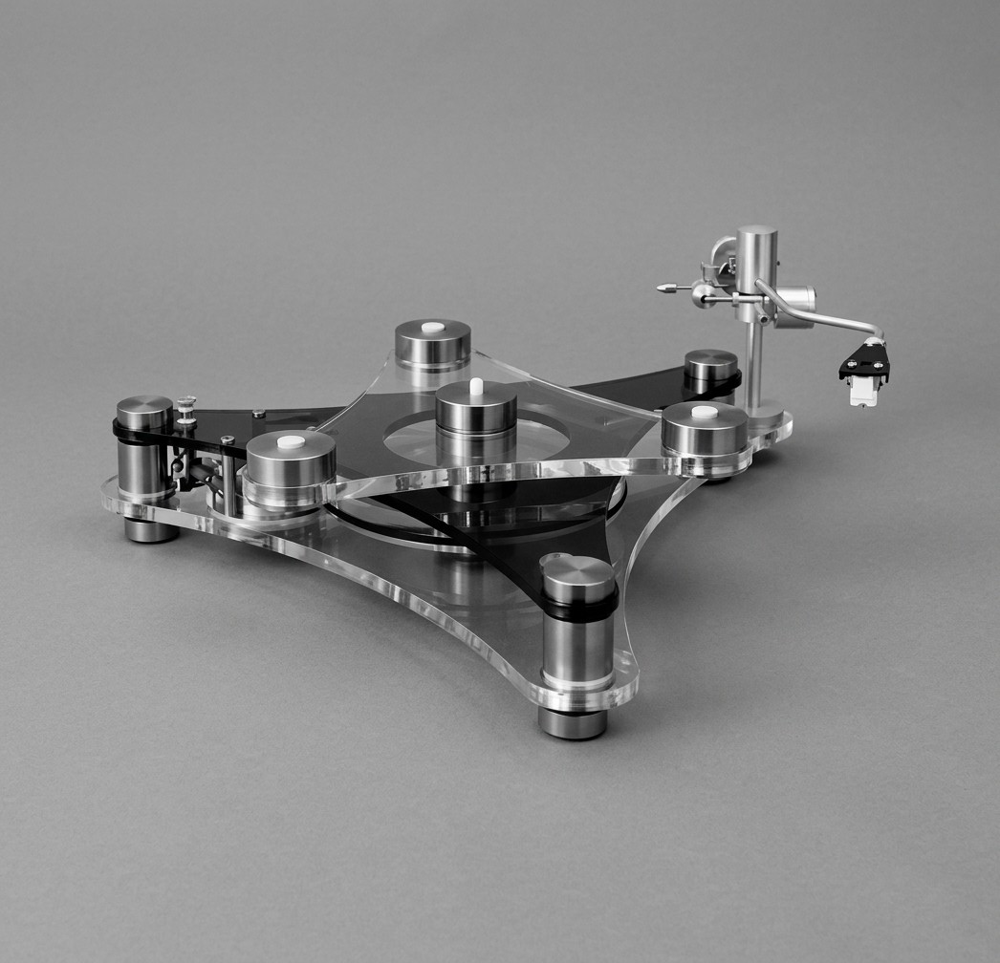
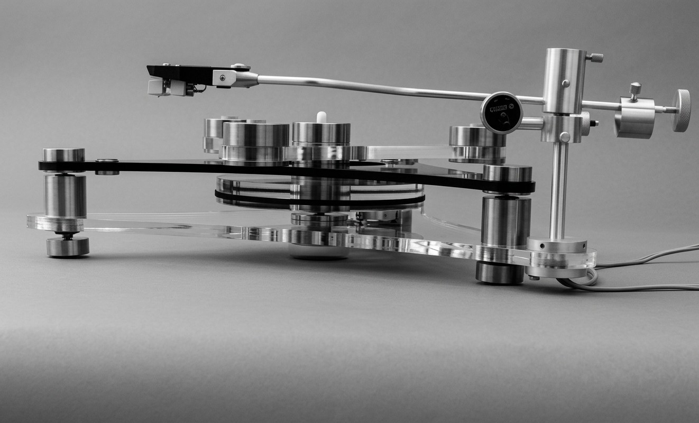
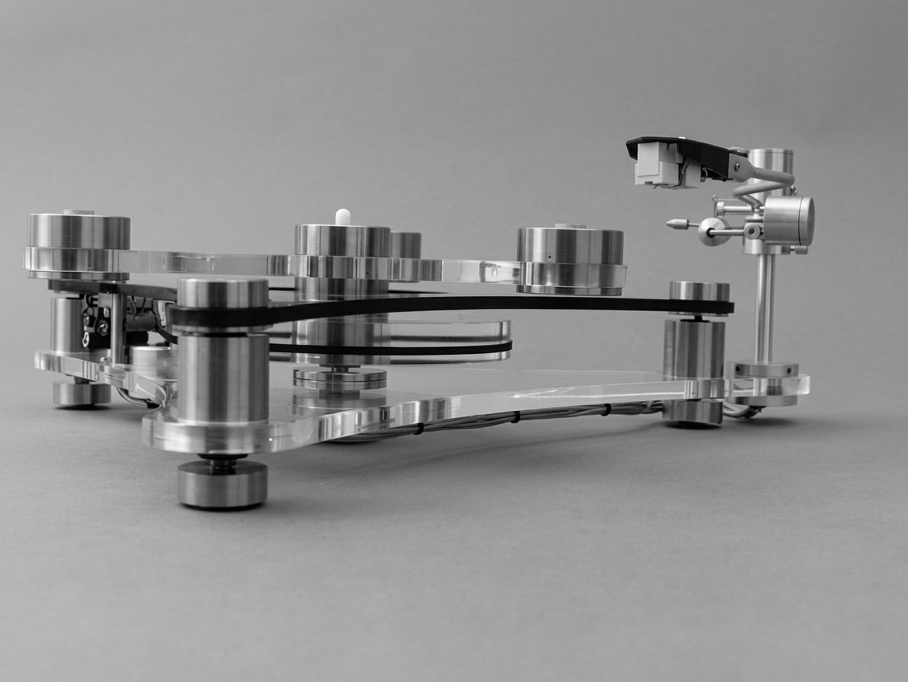
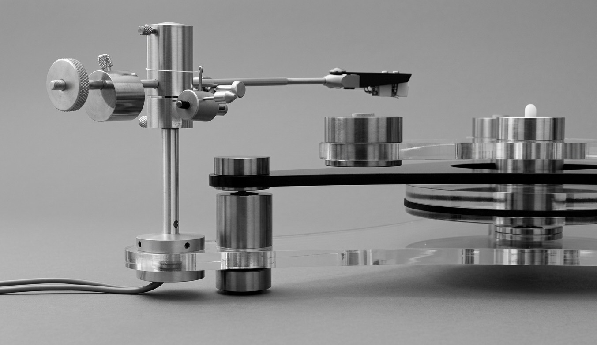
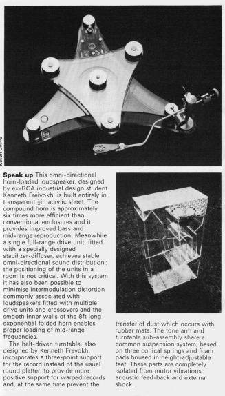
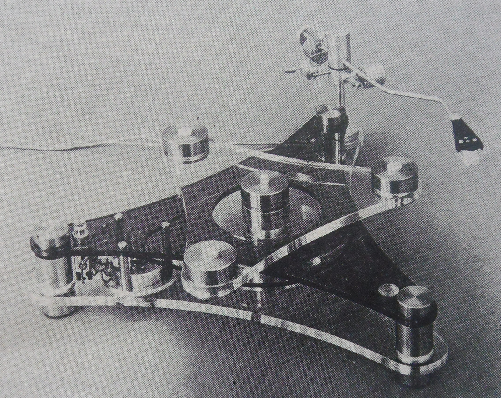
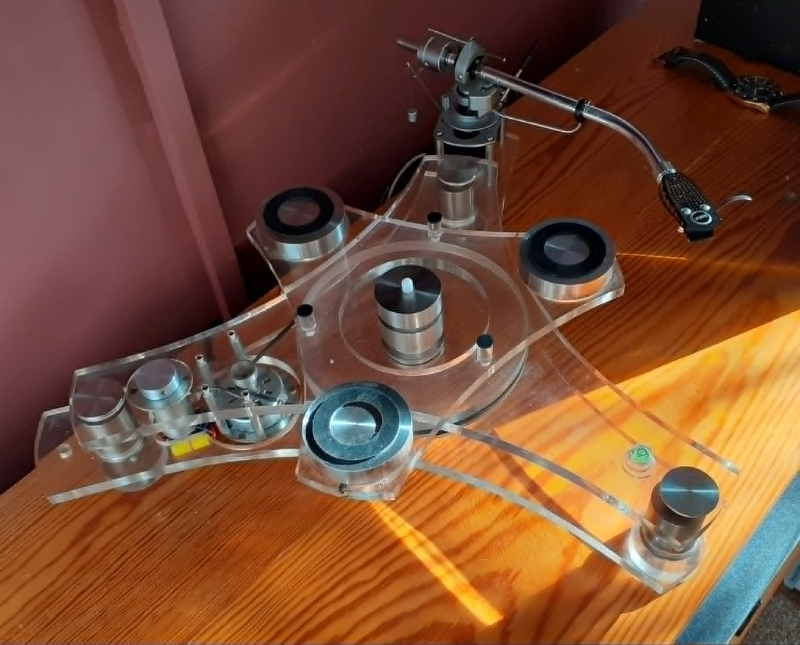
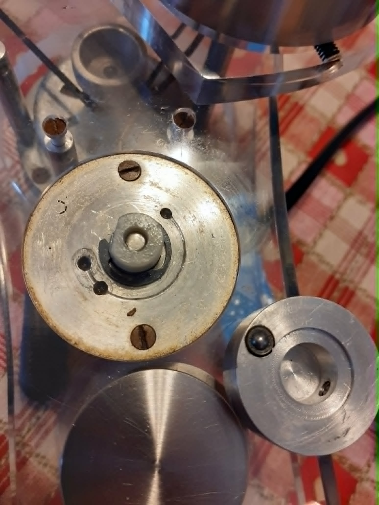
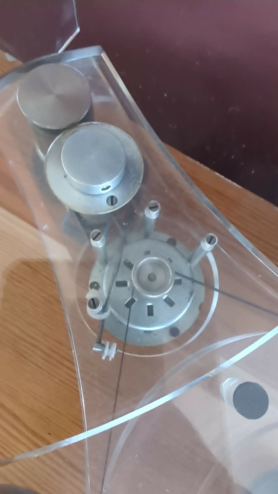
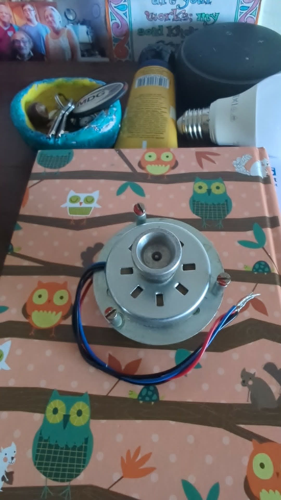

# GT2101 Early Machines

This page records three **distinct early machines** identified in the photographs and source material reviewed so far. It is not a claim that only three early machines were made. Provenance and recollections are attributed to their sources; uncertain identifications are marked as such.

## Ken Freivokh’s precursor turntable

John Maybury’s old GaleAudio.com site published this photograph in the 12 April 2012 post “Mystery Turntable Identified!” The post gives the following statement beneath it, signed by **Ken Freivokh**:

> “That is indeed the original prototype based on the experimental one I machined myself at the Royal College of Art 1971/2.”

This identifies the pictured machine as the original one **based on** Freivokh’s Royal College of Art experiment. It does not establish that this photographed machine is itself the exact machine he machined there. The 1971/2 date comes from Freivokh’s later first-hand recollection.

**Source:** GaleAudio.com WordPress archive, “Mystery Turntable Identified!”, 12 April 2012; preserved in John Maybury’s original website files.

### Ken Freivokh’s account, September 2026

In an email to the archive in September 2026, Ken Freivokh added the following:

- **His thesis.** He wrote a thesis of more than 40 pages on the turntable, titled **“A Transcription Turntable Unit”**, with studies, drawings and photographs. He completed it and presented it to the Royal College of Art at the **end of March 1972**. He still has the paper copy and has offered to scan it for the archive.
- **Where it was made.** All the work on the turntable was done at the college, with the help of the Industrial Design (Engineering) technicians and their lathes and other machinery.
- **How many he made.** He believes he worked on **two** versions of the star-shaped turntable. One had a top plate in **brown translucent acrylic**; that is the machine in the [black-and-white photograph](#black-and-white-photograph) below, where the top plate looks dark.
- **A third, square version.** He also made a further version with a **square base and lid**, which was more practical for keeping dust out but, in his words, not as “pure” or elegant. He believes it is still in storage.
- **Dennis Arnall.** He does not recall anyone called Dennis Arnall.
- **Credit and payment.** He says that, without his knowledge, a number of people, Ira Gale included, went on to build and sell his design without referring to him, and that he received no royalties, no recognition and no payment. Other sources describe the design as **bought**: the [1981 D. W. Labs letter](/GT2101/manuals-literature/#letter-from-d-w-labs-limited-to-huub-bouwmeester-28-january-1981) says it was “purchased”, and Nigel Hobden recalls that Ira Gale bought the design and rights. The 1974 patent does name Freivokh as one of its five inventors. The archive records these accounts side by side; it does not settle them.

In a further email on 1 October 2026, Freivokh said he had only a couple of meetings with Ira Gale, and that he learned from them that **the turntable had been accepted by the Museum of Modern Art, New York**. The archive has not yet confirmed this with the museum, or established which version of the turntable it refers to.

Since leaving the college, Freivokh has worked mainly as a yacht designer, including the 88m *Maltese Falcon* and the 107m *Black Pearl*.

### Thesis photographs, 1972

These photographs are from Ken Freivokh’s Royal College of Art degree thesis, **“A Transcription Turntable Unit”**, presented at the end of March 1972. They show his star-shaped acrylic turntable as he built it at the college.

The photographs appear to show the features described in *Design* in August 1973 (below): a belt drive around the sub-platter, and a record support made of separate raised pads rather than a round platter. They also show the clear and dark acrylic plates and the steel pillars that the GT2101 later kept.

**Source:** Ken Freivokh, “A Transcription Turntable Unit”, degree thesis, Royal College of Art, March 1972.

### Magazine article: “Speak up”, Freivokh's turntable and loudspeaker

An item from the “Things seen” section of ***Design*** (the Design Council's journal), **issue 296, August 1973**, pages 20–23. It describes two designs by Kenneth Freivokh as an ex-Royal College of Art industrial design student: a transparent horn-loaded loudspeaker and a **belt-driven acrylic turntable**. The photographer's credit printed down the side of the picture is not legible in this copy.

**Source:** *Design* journal, no. 296, August 1973, “Things seen” (editorial), pp. 20–23, article 296.21. Found in the Design Journal collection on [VADS](https://vads.ac.uk/). The original material is copyright of the Design Council or the individual authors and photographers; the digitised images are copyright of the London College of Communication, University of the Arts London. Reproduced here for historical reference.

**Transcription**

> **Speak up** This omni-directional horn-loaded loudspeaker, designed by ex-RCA industrial design student Kenneth Freivokh, is built entirely in transparent ¼in acrylic sheet. The compound horn is approximately six times more efficient than conventional enclosures and it provides improved bass and mid-range reproduction. Meanwhile a single full-range drive unit, fitted with a specially designed stabilizer-diffuser, achieves stable omni-directional sound distribution: the positioning of the units in a room is not critical. With this system it has also been possible to minimise intermodulation distortion commonly associated with loudspeakers fitted with multiple drive units and crossovers and the smooth inner walls of the 8ft long exponential folded horn enables proper loading of mid-range frequencies.
>
> The belt-driven turntable, also designed by Kenneth Freivokh, incorporates a three-point support for the record instead of the usual round platter, to provide more positive support for warped records and, at the same time prevent the transfer of dust which occurs with rubber mats. The tone arm and turntable sub-assembly share a common suspension system, based on three conical springs and foam pads housed in height-adjustable feet. These parts are completely isolated from motor vibrations, acoustic feed-back and external shock.

**Why it matters**

- It dates Freivokh's belt-driven turntable to **no later than August 1973**, about fourteen months before the GT2101's debut at the October 1974 Audio Fair.
- It is **contemporary, published evidence** that Freivokh's own turntable was **belt-driven**, agreeing with the 1981 D. W. Labs letter's statement that the original design was belt drive before Gale changed it to direct drive.
- It confirms Freivokh as the designer of the turntable in his own right, as a Royal College of Art industrial design student.
- The turntable described here holds the record on a **three-point support instead of a round platter**. The machine in the 2012 photograph above has a round platter. That fits Freivokh's own description of the 2012 machine as one **based on** his experimental machine, rather than the experimental machine itself.
- Its suspension (three conical springs with foam pads in height-adjustable feet) is an early form of the three-point suspension idea that the GT2101 kept.

## Black-and-white photograph

An image recovered from the old GaleAudio.com site's September 2011 WordPress uploads shows a **different machine** from the 2012 photograph above. Its angular, two-level structure and exposed components are visible. The upload context dates the website file, not the photograph.

**Identified by Ken Freivokh.** In September 2026 Freivokh identified this as one of the two star-shaped turntables he worked on at the Royal College of Art. Its top plate was **brown translucent acrylic**, not black; it looks dark in this black-and-white print.

**Comparison with the 1973 *Design* photograph.** This machine closely resembles the turntable pictured in the August 1973 *Design* article above: the same star-shaped layout, the same arrangement of pucks and central stack, and what appears to be the same tone arm. The acrylic looks dark here but clear in the *Design* picture. Freivokh's account of two versions, one with a brown top plate, suggests the two photographs may show his two different versions rather than the same machine in different light. A larger scan of the *Design* photograph would allow a closer check of the arm, fixings and cut-outs.

### Related technical drawing

This drawing was uploaded alongside the photograph as page 4 in the same named scan sequence. It shows a three-arm chassis plan and side section with reference callouts. It is design documentation, not a photograph of another surviving machine. Its precise relationship to the photographed machine, any other specific machine, or the production model has not been established.

## Ray Churchouse’s Ken Freivokh turntable, now with Mark Churchouse

**Ken Freivokh has confirmed that he made this turntable.** It is one of Freivokh’s own machines, not a Gale prototype. In an email to the archive on 1 October 2026 he identified it as his second version:

> “Indeed, I believe that was the second prototype, still with the same motor, belt drive and arm, but with the more refined and practical treatment of the platter terminations – the original was a full round on the three corners.”

So this second machine kept the first one’s motor, belt drive and tonearm, and changed the shape of the ends of the three platter arms: on the first machine they were fully rounded.

The photographs below document the turntable that belonged to **Ray Churchouse** and is now with his son **Mark Churchouse**. The photos were supplied from material shared about the machine. Mark says his father displayed it in his Unilet shops. Mark also relays that someone who worked in the shop said it had never worked. This is second-hand testimony; the archive has no independent record of the display history or operational status. Mark says he has no further information about Gale from his father.

### Plinth and platter

### Motor and support structure

### Controller and chassis

More photographs of Mark’s turntable can be added to this record as they are provided.

## What is established, and what remains open

- The three machines described above are distinct examples, according to the owner’s identification of the photographs.
- Freivokh’s signed 2012 statement explicitly connects the first pictured machine to the experimental machine he machined at the Royal College of Art in 1971/2.
- The “Speak up” magazine article describes Freivokh's own turntable as belt-driven, with a three-point record support instead of a platter. Source: *Design* no. 296, August 1973.
- Ken Freivokh has identified the black-and-white machine as one of his two star-shaped turntables, with a brown translucent top plate.
- Freivokh wrote a thesis, “A Transcription Turntable Unit”, presented to the Royal College of Art at the end of March 1972. He also made a third, square-based version.
- Ken Freivokh has confirmed that he made the Ray/Mark Churchouse turntable (email, 1 October 2026). He believes it is his **second** version: the same motor, belt drive and arm as the first, with more refined ends to the three platter arms. When it was made, and how it came to Ray Churchouse, are not yet recorded.
- The archive has evidence for three separate early machines in these records. It does **not** establish the total number of early machines made.

See the [GT2101 historical timeline and source notes](/GT2101/research-notes/) for the broader development and marketing chronology.

