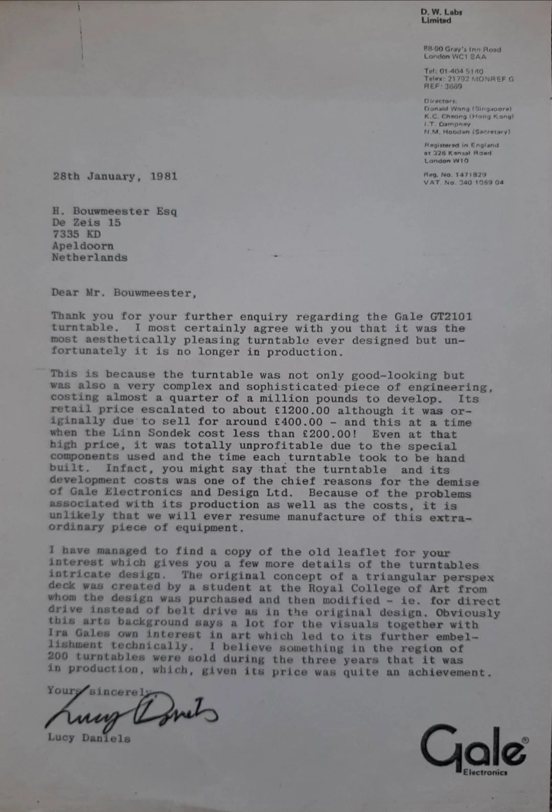

# Manuals & Literature

A home for **factory manuals, period write-ups, service notes, and contemporary research** related to the **Gale GT2101**.

  <strong>Under construction</strong> 
  We’re cleaning scans and extracting searchable text. When available, we’ll post accessible HTML summaries alongside original scans.

## Coming soon

- Owner’s/Setup guide (searchable)  
- Service adjustments (33⅓ / 45, strobe/LED display)  
- Motor & control theory overview  
- Period adverts and reviews (with dates and sources)  
- Provenance notes and interview excerpts

  

    <strong>Owner’s Guide</strong> 
    <small>Setup, care, transport</small>
  

  

    <strong>Service Notes</strong> 
    <small>Checks, alignments, troubleshooting</small>
  

  

    <strong>Period Articles</strong> 
    <small>Sourced, dated, credited</small>
  

  

    <strong>Provenance</strong> 
    <small>Designers, production notes</small>
  

## Correspondence

### Letter from D. W. Labs Limited to Huub Bouwmeester, 28 January 1981

A typed reply to an enquiry about the GT2101 from Huub Bouwmeester in Apeldoorn, the Netherlands. It is written on D. W. Labs Limited letterhead from 88–90 Gray's Inn Road, London WC1, with the Gale Electronics logo at the foot, and signed by **Lucy Daniels**. The listed directors of D. W. Labs are Donald Wong (Singapore), K. C. Cheong (Hong Kong), I. T. Dampney and N. M. Hobden (Secretary).

**Transcription**

> Dear Mr. Bouwmeester,
>
> Thank you for your further enquiry regarding the Gale GT2101 turntable. I most certainly agree with you that it was the most aesthetically pleasing turntable ever designed but unfortunately it is no longer in production.
>
> This is because the turntable was not only good-looking but was also a very complex and sophisticated piece of engineering, costing almost a quarter of a million pounds to develop. Its retail price escalated to about £1200.00 although it was originally due to sell for around £400.00 – and this at a time when the Linn Sondek cost less than £200.00! Even at that high price, it was totally unprofitable due to the special components used and the time each turntable took to be hand built. Infact, you might say that the turntable and its development costs was one of the chief reasons for the demise of Gale Electronics and Design Ltd. Because of the problems associated with its production as well as the costs, it is unlikely that we will ever resume manufacture of this extraordinary piece of equipment.
>
> I have managed to find a copy of the old leaflet for your interest which gives you a few more details of the turntables intricate design. The original concept of a triangular perspex deck was created by a student at the Royal College of Art from whom the design was purchased and then modified – ie. for direct drive instead of belt drive as in the original design. Obviously this arts background says a lot for the visuals together with Ira Gales own interest in art which led to its further embellishment technically. I believe something in the region of 200 turntables were sold during the three years that it was in production, which, given its price was quite an achievement.
>
> Yours sincerely,
>
> Lucy Daniels

**Why it matters**

- It is a **1981 company document**, written within a few years of production ending, that supports Nigel Hobden's 2026 recollection that Gale **bought the design** from Royal College of Art student Kenneth Freivokh (who is not named in the letter).
- It records that Freivokh's original design was **belt drive** and was modified by Gale for direct drive.
- It gives a development cost of **almost £250,000**, a planned price of about **£400** rising to about **£1,200**, a production run of **about three years**, and sales of **around 200** turntables.
- It says the GT2101 and its development costs were **one of the chief reasons for the demise of Gale Electronics and Design Ltd**, and that the deck was unprofitable even at its final price.
- It shows Gale-branded business continuing under **D. W. Labs Limited** in 1981, with Ian Dampney and Nigel Hobden among the directors.

See the [GT2101 research notes](/GT2101/research-notes/) for how this letter fits the wider timeline.

<small>All materials preserved for educational and historical reference. Rights remain with original authors.</small>
