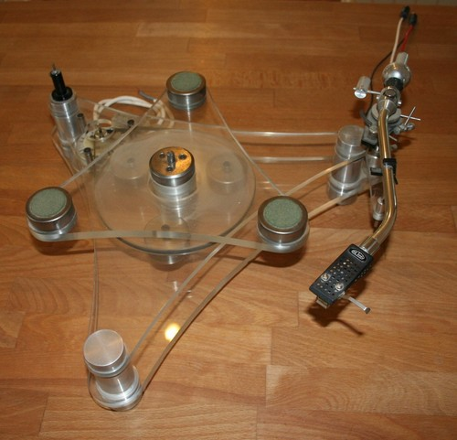
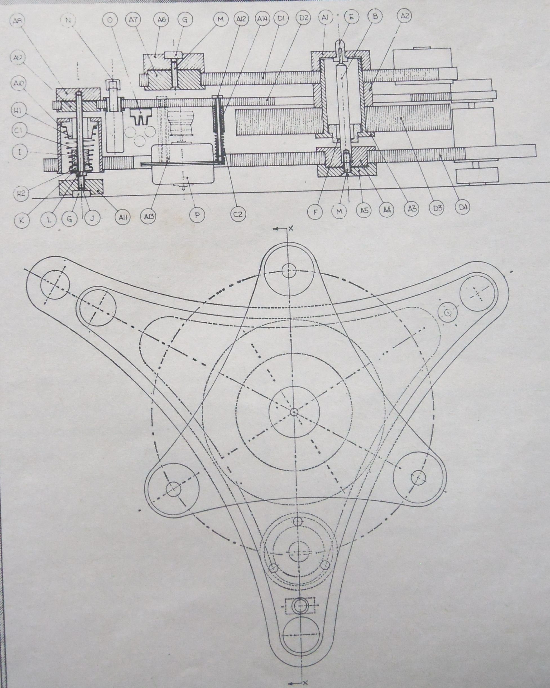
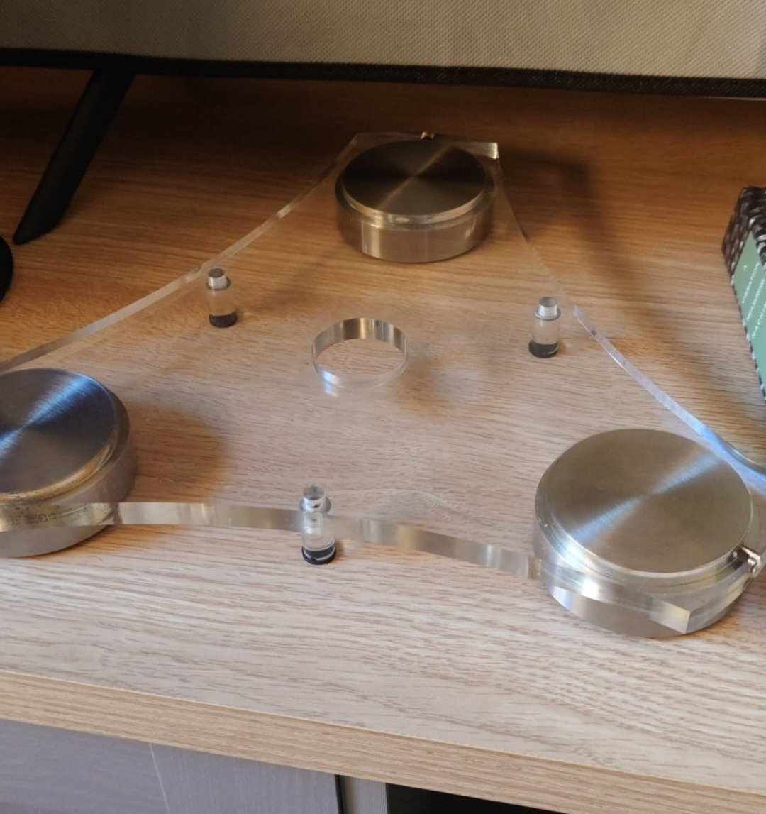
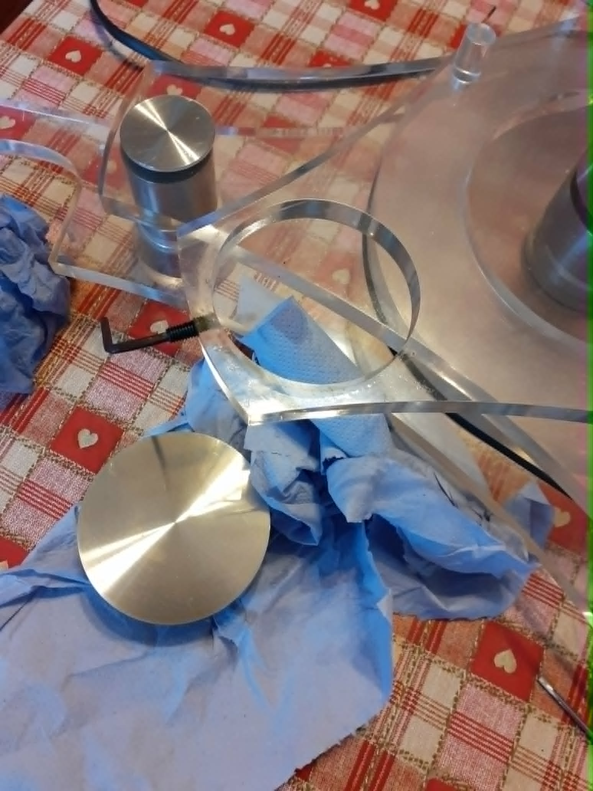
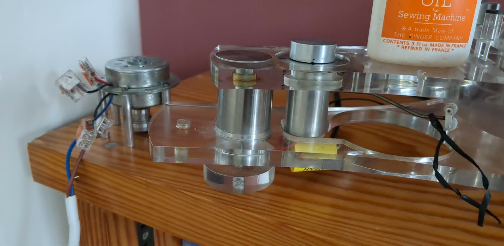

# GT2101 Prototype Records

This page records three **distinct prototype machines** identified in the photographs and source material reviewed so far. It is not a claim that Gale made only three prototypes. Provenance and recollections are attributed to their sources; uncertain identifications are marked as such.

## Prototype associated with Ken Freivokh

John Maybury’s old GaleAudio.com site published this photograph in the 12 April 2012 post “Mystery Turntable Identified!” The post gives the following statement beneath it, signed by **Ken Freivokh**:

> “That is indeed the original prototype based on the experimental one I machined myself at the Royal College of Art 1971/2.”

This identifies the pictured machine as the original prototype **based on** Freivokh’s Royal College of Art experiment. It does not establish that this photographed machine is itself the exact machine he machined there. The 1971/2 date comes from Freivokh’s later first-hand recollection.

**Source:** GaleAudio.com WordPress archive, “Mystery Turntable Identified!”, 12 April 2012; preserved in John Maybury’s original website files.

## Black-and-white prototype photograph

An image recovered from the old GaleAudio.com site's September 2011 WordPress uploads shows a **different machine** from the Freivokh-associated photograph above. Its angular, two-level structure and exposed components are visible. The upload context dates the website file, not the photograph or the machine; the machine's identity, date and provenance remain unconfirmed.

### Related technical drawing

This drawing was uploaded alongside the photograph as page 4 in the same named scan sequence. It shows a three-arm chassis plan and side section with reference callouts. It is design documentation, not a photograph of another surviving prototype. Its precise relationship to the photographed machine, a specific prototype, or the production model has not been established.

## Ray Churchouse prototype, now with Mark Churchouse

The photographs below document the prototype that belonged to **Ray Churchouse** and is now with his son **Mark Churchouse**. The photos were supplied from material shared about the machine. Mark says his father displayed it in his Unilet shops. Mark also relays that someone who worked in the shop said the prototype had never worked. This is second-hand testimony; the archive has no independent record of the display history or operational status. Mark says he has no further information about Gale from his father.

### Plinth and platter

### Motor and support structure

### Controller and chassis

More photographs of Mark’s prototype can be added to this record as they are provided.

## What is established, and what remains open

- The three machines described above are distinct examples, according to the owner’s identification of the photographs.
- Freivokh’s signed 2012 statement explicitly connects the first pictured machine to the experimental machine he machined at the Royal College of Art in 1971/2.
- The black-and-white machine has no confirmed maker, owner, date or link to a named prototype.
- The Ray/Mark Churchouse machine has family provenance, but its date and exact development stage have not yet been documented here.
- It is possible that the Ray/Mark machine relates to development after Freivokh’s earlier experiment, but no evidence reviewed so far establishes that Gale or Sao Win acquired Freivokh’s machine or worked on this specific prototype. Keep this as an open research question, not a confirmed link.
- The archive has evidence for three separate prototype machines in these records. It does **not** establish the total number of prototypes made.

See the [GT2101 historical timeline and source notes](/GT2101/research-notes/) for the broader development and marketing chronology.

